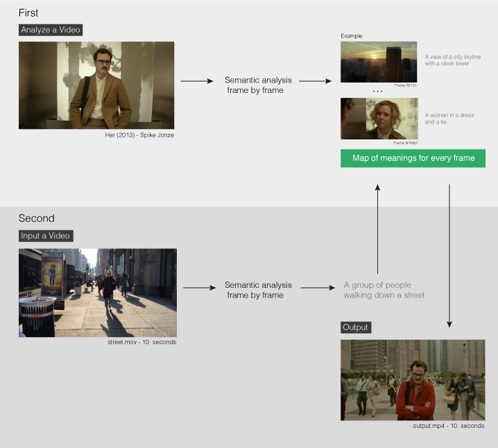

# Scenescoop

Scenescoop is a tool to get similar semantic scenes from a pair of videos. Basically, you input a video and get a scene that has a similar meaning in another video.

This project is inspired by [Thingscoop](https://github.com/agermanidis/thingscoop) made by [@agermanidis](https://github.com/agermanidis).

## How it works

Scenescoop uses the [im2text](https://github.com/tensorflow/models/tree/master/research/im2txt) tensorflow model on a frame by frame basis over the input and transfer video. It then [Spacy](https://spacy.io/) and [Annoy](https://github.com/spotify/annoy) to average the meaning of words ...

# Demos

# Usage

# License

Get the pretrained model from [here](https://drive.google.com/open?id=1tSTzD21qXXOiXlfgJllgXNZ9lREy6yij)